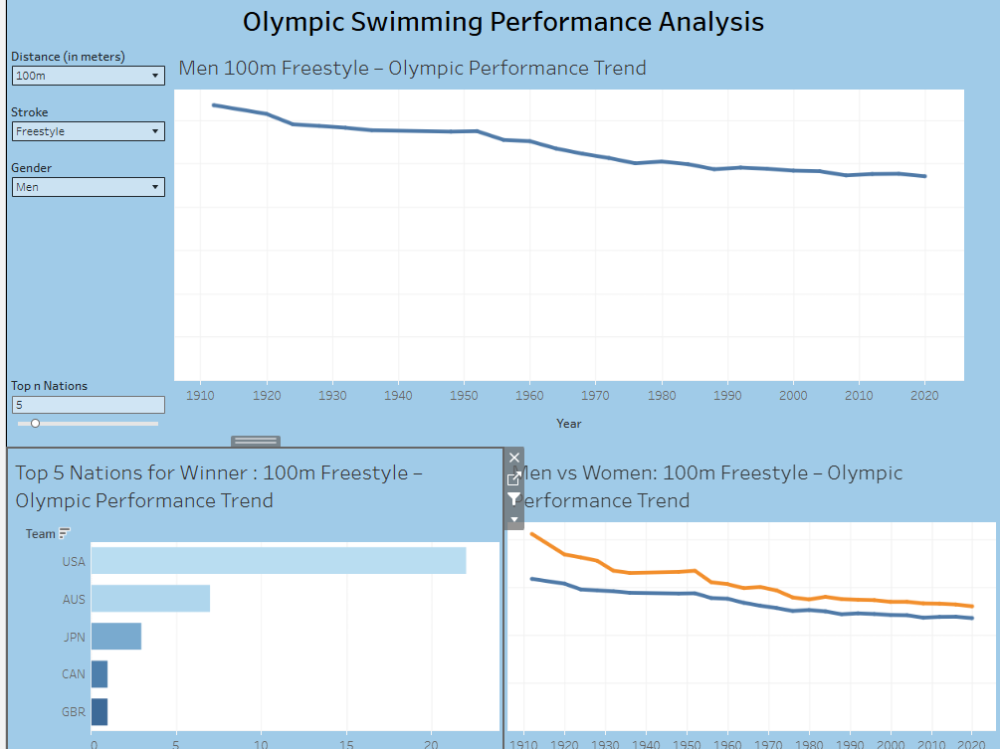

# olympic-swimming-analysis
# 🏊 Analisi delle Performance nel Nuoto Olimpico

## 📊 Panoramica
Questo progetto analizza l’evoluzione delle performance nel nuoto olimpico dal 1912 al 2020, con focus su trend temporali, differenze di genere e dominanza delle nazioni.

È stata inoltre sviluppata una previsione delle performance future fino al 2032.

---

## 🎯 Obiettivi
- Analizzare l’andamento dei tempi nel tempo  
- Confrontare le performance tra uomini e donne  
- Identificare le nazioni dominanti  
- Stimare le performance future  

---

## 📈 Dashboard Interattiva
🔗 Visualizza la dashboard su Tableau:  
https://public.tableau.com/views/analisinuoto1912-2020/Storia1?:language=it-IT&:sid=&:redirect=auth&:display_count=n&:origin=viz_share_link

## 📊 Anteprima Dashboard

---

## 🔮 Modello Predittivo
È stato utilizzato un modello di regressione polinomiale per stimare i tempi futuri nei 100m stile libero maschili.

### Risultati previsti:
- 2024: 46.22 secondi  
- 2028: 45.93 secondi  
- 2032: 45.66 secondi  

---

## 📊 Insight Principali
- Le performance sono migliorate significativamente nel tempo  
- Il miglioramento è rallentato negli ultimi decenni  
- Il gap tra uomini e donne si sta riducendo  
- Gli Stati Uniti dominano storicamente  
- La competizione globale è in aumento  
- I miglioramenti futuri saranno marginali  

---

## 🛠️ Strumenti Utilizzati
- Tableau (visualizzazione dati)  
- Python (Pandas, Scikit-learn, Matplotlib)  
- Google Colab  

---

## 📁 Struttura del Progetto
- `data/` → dataset  
- `notebooks/` → modello predittivo e pulizia dati
- `images/` → grafici e dashboard  

---

## 🚀 Sviluppi Futuri
- Estendere la previsione ad altre distanze e stili  
- Creare dashboard predittive interattive  
- Utilizzare modelli più avanzati  

---

## 👤 Autore
Marco Temperato
